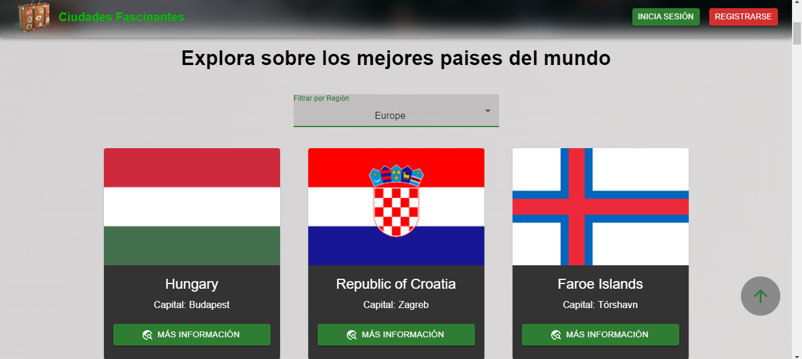

# Ciudades Fascinantes App

Ciudades fascinantes it's an app about information of countries and cities. It's my final project for an intensive course of Next.js and React.js. I built the app with Next.js, React.js, Firebase and Material UI. For the data images I used the Unsplash API, and for the information of the countries and cities I used REST countries API.

## Link

Deploy Site: [https://folcademy-next-app.vercel.app](https://folcademy-next-app.vercel.app)

## Screenshots





<div style="width: 100%; display: flex; justify-content: center; align-items: center; gap: 16px; flex-wrap: wrap">


</div>

---

## API

- [https://restcountries.com/#api-endpoints-v3-code](https://restcountries.com/#api-endpoints-v3-code)

- [https://unsplash.com/developers](https://unsplash.com/developers)

## Built with

- Next.js
- React.js
- Javascript
- Material UI
- Firebase Auth
- Next.js Hooks
- Get Server Side Props
- React Hooks

## How to use

> Before you can run this app, you need to get your personal API KEYS from Firebase and put it into a .env.local file with the Environment Variables, please go to [Firebase](https://firebase.google.com/) and create your project with Firebase Auth.

1. Clone this repo

   ```bash
       git clone https://github.com/matiarias/ciudades-fascinantes-next-js-app
   ```

2. Install all the required dependencies.

   ```bash
       npm install
   ```

3. To start on your local machine:

   ```bash
       npm run dev
   ```
